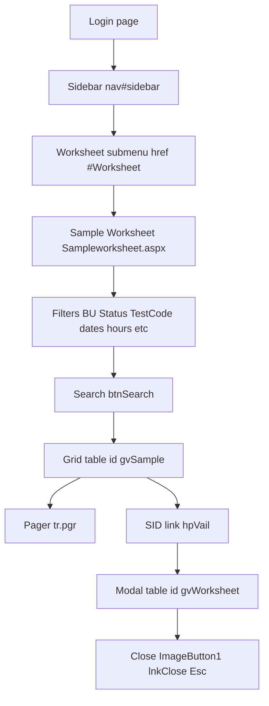

# LIS navigation reference (Sample Worksheet)

Internal structure-only guide for traversing the Laboratory Information System (LIS) web UI used with the Genomics/Sample Worksheet. Filter **values** are not documented here — only routes, control patterns, and read-flow mechanics.

**Source code reference:** patterns are distilled from `X:\Listec Automation\cbc_reader_bot.js`, `lis_worksheet_speed.js`, and related autobots (read-only code inspection).

---

## 1. Entry points and authentication

| Item | Detail |
| --- | --- |
| Primary login URL | `http://122.161.198.159:88/login.aspx` (see `cbc_reader_bot.js` `PRIMARY_LOGIN_URL`) |
| Backup login URL | `http://192.168.1.51:88/login.aspx?ReturnUrl=%2f` (`BACKUP_LOGIN_URL`) |
| Credentials (local) | Prefer `CBC_LOGIN_USERNAME` / `CBC_LOGIN_PASSWORD` in `.env`; fallback `LOGIN_USERNAME` / `LOGIN_PASSWORD`; see `X:\Listec Automation\.env` |
| Username field | First `//input[@type='text']` on login page |
| Password field | `//input[@type='password']` |
| Submit | `//button` containing "Login", or `//input[@type='submit']` with value Login, or generic `//button[@type='submit']` / `//input[@type='submit']` |
| Post-login wait | Wait for sidebar: `//nav[@id='sidebar']` (timeout ~20s) |

---

## 2. Sidebar navigation → Sample Worksheet

1. Expand **Worksheet** collapsible:  
   `//nav[@id='sidebar']//a[@data-toggle='collapse' and @href='#Worksheet']`  
   (fallback: `//a[@data-toggle='collapse' and @href='#Worksheet']`)

2. Click link to **Sampleworksheet.aspx**:  
   - `//ul[@id='Worksheet']//a[contains(@href, 'Sampleworksheet.aspx')]`  
   - Fallbacks: href contains `sampleworksheet`, or scan all `a` for `sampleworksheet` in href

3. Expected path pattern: `/Worksheet/SampleWorksheet.aspx` (ASP.NET WebForms).

---

## 3. Worksheet filter form (selectors — no values)

All IDs use ASP.NET master-page prefixes (`ctl00_ContentPlaceHolder_Main_...`). Prefer **substring** matches: `[id*='...']`, not full IDs.

| Control | Mechanism | Selector / notes |
| --- | --- | --- |
| Business Unit | Native `<select>` + **Select2** | `select[id*='ddlBunit'], select[name*='ddlBunit'], select[id*='BusinessUnit']`. After setting `.value`, dispatch `change` and sync Select2: `jQuery(select).val(value).trigger('change')` if present. UI: `span.select2-selection[title='Business Unit']`. **Do not** set BU select to empty string — can trigger full postback. |
| Status | Native `<select>` + Select2 | `select[id*='ddlStatus'], select[name*='ddlStatus']` |
| Test code | Text input | `input[id*='txtTestcode'], input[name*='txtTestcode']` |
| From / To date | Text inputs (DD/MM/YYYY) | `input[id*='txtFdate']`, `input[id*='txtTodate']` — set `.value`, dispatch `input` and `change` |
| From / To hour | `<select>` + Select2 | Id/name contains `ddlFtime` (from) and `ddlFtime0` (to); match option by value or displayed hour |
| Department | `<select>` + Select2 | e.g. `select[id*='ddlDeptNo']` (urine autobot sets dept by value or option text) |
| Valid / Vail Id | Text (used as barcode search in some bots) | `input[id*='txtvailid'], input[id*='txtVailid']`, etc. |
| Client code, SID, PID | Text | Typical LIS naming: inputs whose `id`/`name` contains `Client`, `Sid`, `Pid` (exact spelling varies — resolve at runtime). |
| Search | Submit control | `input[id*='btnSearch']`, or `input[type='submit'][value*='Search']`, or `button` with text Search |

---

## 4. Sample grid (`gvSample`)

| Item | Detail |
| --- | --- |
| Table | `table[id*='gvSample']` |
| After Search | Wait for grid selector, short settle delay (~400–700ms) |
| SID link | `a[id*='hpVail']` in row, or `td:nth-child(4) a` fallback |
| Regional rows (QUGEN) | Rows may show `span[id*='lblmccCode'] span.badge` for other labs; CBC can **skip** these client-side when narrowing to one BU |
| Pager | Row `tr.pgr` inside/near grid; page numbers as links/spans, **Next**, or `__doPostBack(...Page$Next...)` |

---

## 5. Open SID → worksheet modal (`gvWorksheet`)

| Step | Detail |
| --- | --- |
| Open | Click anchor whose text matches SID: `//a[normalize-space(text())='&lt;SID&gt;']` |
| Modal visible | `table[id*='gvWorksheet']` with non-zero bounding rect and `display` / `visibility` not hidden |

---

## 6. Inside the worksheet modal (structure)

| Part | Selector pattern |
| --- | --- |
| Rows | `table[id*='gvWorksheet'] tbody tr` |
| Test name | `span[id*='lblTestname']` or first `td` |
| Value | `textarea[id*='txtValue'], input[id*='txtValue']` |
| Comments | Field with `txtComments` in id (used by CBC platelet flow — **do not touch** in read-only tooling) |
| Save | `input`/`button` with `btnSave` in id — **read-only bot must not invoke** |

---

## 7. Close modal (non-destructive)

Order used by CBC:

1. `input[type='image'][id*='ImageButton1']` (Close.gif variants)
2. `//a[contains(@id,'lnkClose')]`, class `btn-danger` "X"
3. `Escape` key
4. Last resort: hide `.modal` wrappers, remove `.modal-backdrop`, clear `modal-open` on `body`

---

## 8. Navigation map

---

## 9. Conventions and gotchas

- Use **substring** ID matches; never hardcode full `ctl00_...` unless debugging one build.
- Dropdowns: always sync **Select2** after changing the native `<select>`.
- Do not clear Business Unit to `''` (dangerous postback).
- Date fields need both `input` and `change` events after assignment.
- Modals are Bootstrap-style; closing may need multiple strategies.

---

## 10. Related automation (this repo)

Read-only CLI: `scripts/lis-nav-bot/` — navigates and optionally dumps grid/modal **without** saving or editing worksheet values.
